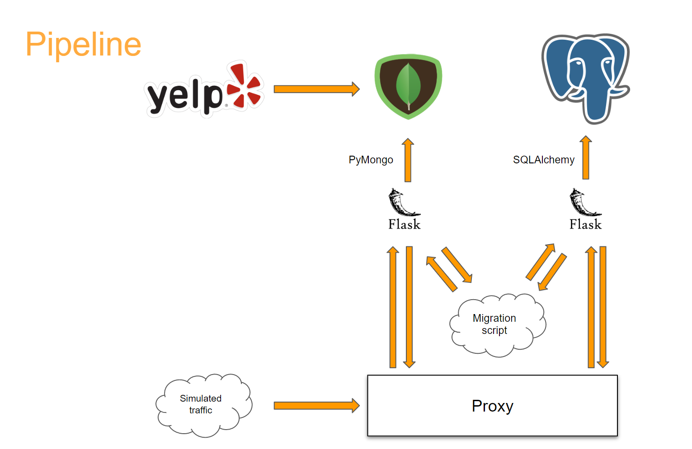
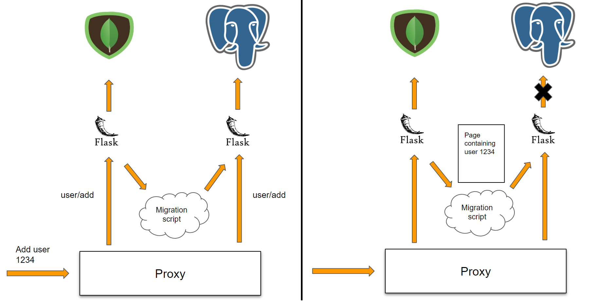
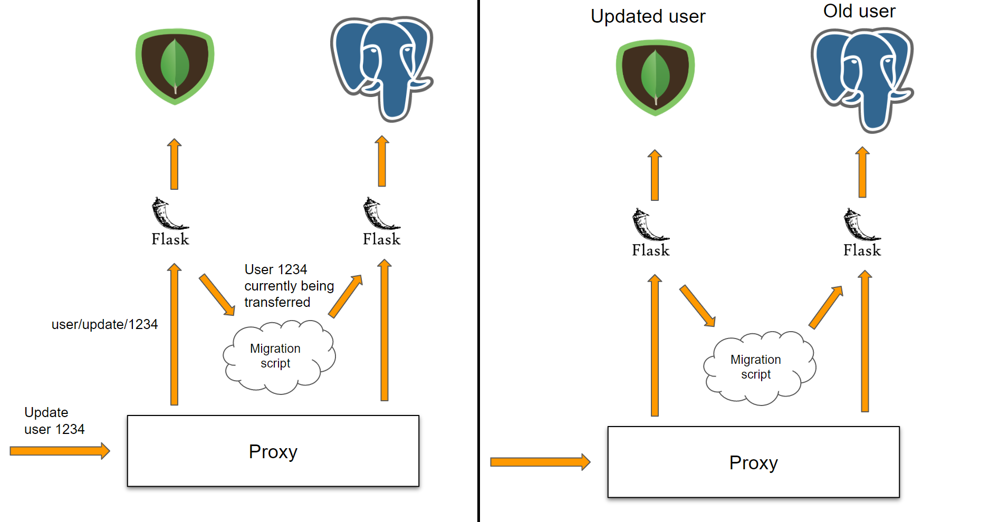

# Database-Migration

Seamlessly migrate the Yelp dataset from MongoDB to PostgreSQL on Amazon RDS

[Link to presentation slides](https://docs.google.com/presentation/d/1btjZ559A031FWwBrEUel30LVHatJSlC6ICJMF3SYW7k/edit?usp=sharing)

## Introduction

There are a lot of reasons a company might want to migrate their data from a self managed database cluster to an managed service like Amazon RDS. My project was inspired by a blog written by The Guardian that described their process for migrating all of their online content from MongoDB to PostgreSQL. That article can be found [here](https://www.theguardian.com/info/2018/nov/30/bye-bye-mongo-hello-postgres). Some existing migration tools only support relational to relational migration. In addition, businesses need a way to migrate their data without interuptions while requests continue to come in.

## Architecture

## Engineering challenges

Additions must be tracked to ensure a newly added entry is not migrated

To fix this, the migration script automatically updates a config file which contains the sizes of each mongo collection. This way, the script knows exactly how many documents existed when migration started so it knows when to stop. The last page is limited to not include any new additions

Updates and deletes happening to documents currently being transferred can't be lost

Every update and delete request is logged. After migration was complete, each was ran on the new database. These logs are also crucial for verifying successful migration. Each request that was updated or deleted is checked across the two databases for differences

